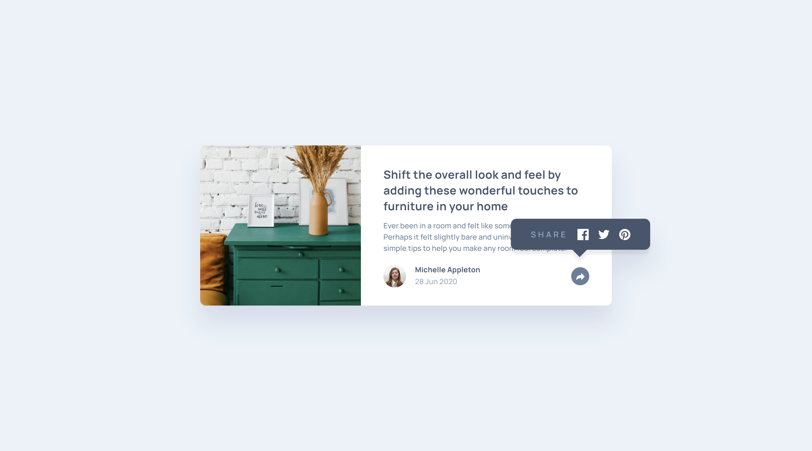

# Frontend Mentor - Article preview component solution

This is a solution to the [Article preview component challenge on Frontend Mentor](https://www.frontendmentor.io/challenges/article-preview-component-dYBN_pYFT). Frontend Mentor challenges help you improve your coding skills by building realistic projects.  

## Table of contents

- [Overview](#overview)
  - [The challenge](#the-challenge)
  - [Screenshot](#screenshot)
  - [Links](#links)
- [My process](#my-process)
  - [Built with](#built-with)
  - [What I learned](#what-i-learned)
  - [Continued development](#continued-development)
  - [Useful resources](#useful-resources)
- [Useful commands](#useful-commands)
- [Author](#author)

## Overview

### The challenge
- Responsive layout article about decorating interior space.
- Users should be able to:
    - View the optimal layout for the component depending on their device's screen size
    - See the social media share links when they click the share icon

### Screenshot
<div>
  
  
</div>

### Links

- Solution URL: [My solution URL](https://github.com/MiloosN5/FrontendMentor_ArticlePreviewComponent_Challenge)
- Live Site URL: [My live site URL](https://miloosn5.github.io/FrontendMentor_SocialProofSectionMaster_Challenge/)


## My process

### Built with

- Semantic HTML5 markup
- Tailwindcss
- SASS/SCSS
- BEM
- Flexbox
- Mobile-first workflow
- REM (Root EM) & EM (for Responsive)
- Responsive layout
- [React](https://reactjs.org/) - JS library

### What I learned

* **Overlaying popup & z-index**<br>
    The main part of this challenge was creating a popup that appears over the place from where it is called (from footer). In this case, there are some rules that we need to take care of. Since the popup needs to overlay the same area where the default footer is, we don't need to worry about of possible changes of footer's dimensions. This is provided through setting 'left', 'right' & 'bottom' to the zero, plus having full height. The full height is important expecially at the lower screen device's width due to wrapping of the default footer content. Having default layout all the time is necessary because of toggling 'share' button. In order to retain presence of the button when overlay happened, we need to set z-index for that button. When article changed layout at the higher widths, popup is also different. Setting here is different, but we don't depend on the footer changes since the layout is static. Also, one different things is that now popup also has pointed arrow at the bottom. This arrow is created as a pseudo-element (::) of the popup. 
    
    * Footer.jsx
        ```jsx
            const Footer = () => {
                return (
                    <footer ref={ref1} className={`card__footer ${toggle_card__footer}`}>
                        {/*Default layout*/}
                        <div className="card__footerWrapper">
                            ...
                            <div className="card__shareBtn">
                                ...
                            </div>
                        </div>   
                        {/*Popup component*/}
                        <Popup ref={childRef}/>
                    </footer>
                )
            }            
        ```   

    * Popup.jsx
        ```jsx
            const Popup = forwardRef((props, ref) => {
                return (
                    <div className="card__popup opacity-0">
                    <div className="card__popupTitle">SHARE</div>
                    <div className="card__socialIcons">
                        ...
                    </div>
                    </div>
                )
            })           
        ``` 

    * index.scss
        ```scss
            &__popup { 
                @apply absolute flex flex-col ... h-full bottom-0 left-0 right-0 ... ease-in-out duration-300 /*s2*/ s2:flex-row s2:justify-start ... /*t*/ t:h-popup--t t:left-auto ...;
                &::after {
                    @apply /*t*/ t:content-empty t:w-arrow t:absolute ...;  
                }
            }          
        ```    

* **useRef & forwardRef**<br>
    When click event occurs, multiple elements will change its behavior. Using 'useRef' hook, we can reference to these elements. These refs are then send to the click handler. Since the 'popup' component is implemented as a separate component (child component of the 'footer'), we need to get 'ref' from the child. Be aware of the fact that 'ref' can't be forwarded as a normal prop. To achieve this, our child component will be wrapped into the 'forwardRef' function. Within the 'forwardRef', if we don't want to expose the whole DOM node, we can handle our 'ref' to be expressed as a custom value. When working with refs in the parent component, 'current' property of the refs is what we looking for. Value of this property is the current DOM node.  
    
    * Footer.jsx
        ```jsx
            const Footer = () => {
                
                const ref1 = useRef(0);
                const ref2 = useRef(0);
                const ref3 = useRef(0);
                const childRef = useRef(0);
                
                const showPopup = (ref1, ref2, ref3, ref4) => {
                    const footer = ref1.current;
                    const shareBtn_wrapper = ref2.current;
                    const shareBtn_icon = ref3.current.children[0];
                    const popup = childRef.current;

                    footer.classList.toggle(toggle_card__footer);
                    footer.classList.toggle('pb-0');
                    shareBtn_wrapper.classList.toggle(toggle_shareBtn_wrapper);
                    shareBtn_wrapper.classList.toggle('bg-myBlue-lv2');
                    shareBtn_icon.classList.toggle(toggle_shareBtn_icon);
                    shareBtn_icon.classList.toggle('fill-white');
                    popup.classList.toggle('opacity-0');
                    popup.classList.toggle('opacity-100');
                }

                const toggle_card__footer = 'pb-2';
                const toggle_shareBtn_wrapper = 'bg-myBlue-lv4';
                const toggle_shareBtn_icon = 'fill-myBlue-lv2'

                return (
                    <footer ref={ref1} className={`card__footer ${toggle_card__footer}`}>
                        {/*Default layout*/}
                        <div className="card__footerWrapper">
                            <div ref={ref2} className={`card__shareBtn_wrapper ${toggle_shareBtn_wrapper}`} onClick={() => showPopup(ref1, ref2, ref3, childRef)}>
                                <svg ref={ref3} className="card__shareBtn_svg" xmlns="http://www.w3.org/2000/svg" width="15" height="13">
                                    <path className={`${toggle_shareBtn_icon}`} ... />
                                </svg>
                            </div>   
                        </div>
                        {/*Popup component*/}
                        <Popup ref={childRef}/>
                    </footer>
                )
            }            
        ``` 

    * Popup.jsx
        ```jsx
            const Popup = forwardRef((props, ref) => {
                return (
                    <div className="card__popup opacity-0" {...props} ref={ref}>
                        ...
                    </div>
                )
            })         
      ``` 

* **Tailwindcss apply**<br>
    Using BEM along with Tailwindcss can result into some messy, unreadable code. To prevent that, there is a option called "@apply" that Tailwindcss provided to us. As the project grows, there are more and more elements that uses the same utility combination of classes. However, the disadvantes of this approach is that now these styles are integrated into the selector class as a properties. This makes toggling classes with event (e.g. click) more difficult. This is the reason why the toggled classes are left in the .jsx, right after the BEM name, rather than being part of the @apply. 
    
    * index.scss
        ```scss
            &__shareBtn { 
                @apply flex flex-col justify-center w-full /*s2*/ s2:w-auto s2:ml-auto;
            }             
        ```           

### Continued development

* In-depth explorating of React.
* Aspiration to make better responsive layout.
* Aspiration to make better structure of React components.
* Tending to improve BEM naming convention.
* Better handling of the combo of BEM & Tailwindcss in the same project.

### Useful resources

- [React - Components & Props](https://legacy.reactjs.org/docs/components-and-props.html) - Components are independent and reusable bits of code. They serve the same purpose as JavaScript functions, but work in isolation and return HTML.
- [BEM](https://en.bem.info/) - BEM naming convention is also really important for any projects, expecially the bigger ones.
- [Typographic Hierarchy](https://www.toptal.com/designers/typography/typographic-hierarchy) - Understanding your website structure/hierarchy sometimes can be difficult. Determing accurately typography can be half job done. 
- [An Introduction to Block Element Modifiers (BEM)](https://opensenselabs.com/blog/articles/introduction-block-element-modifiers) - Difference between Block, Modifier and Element.
- [Understanding CSS BEM](https://codeburst.io/understanding-css-bem-naming-convention-a8cca116d252) - Examples of how BEM class namings can be done.
- [BEM Grandchildren](https://scalablecss.com/bem-nesting-grandchild-elements/) - Handling naming of the nesting elements.
- [BEM 101](https://css-tricks.com/bem-101/) - Another source about BEM.
- [Tailwindcss](https://tailwindcss.com/) - Official website of the Tailwindcss. Really useful source, since it's docs is very easy to handle, readable & cover different cases - which predefinex class to use, examples, customizing your theme and so on.
- [@apply](https://tailwindcss.com/docs/reusing-styles) - Handle repetable 'utility combinations'.
- [z-index](https://css-tricks.com/almanac/properties/z/z-index/) - Determine stacking order of elements that overlap.
- [ref prop - Special props warning](https://legacy.reactjs.org/warnings/special-props.html) - Pay attention that 'key' & 'ref' can't be forwarded.
- [forwardRef](https://react.dev/reference/react/forwardRef) - For forwarding 'ref', we need to wrapp child component into the 'forwardRef' function.
- [useImperativeHandle](https://react.dev/reference/react/useImperativeHandle) - If we don't want to expose the intire DOM node, we can create custom value.
- [Tailwindcss - Dynamic Class Name](https://stackoverflow.com/questions/69687530/dynamically-build-classnames-in-tailwindcss) - If you came across an any obstacle, there is a big change that you will find your answer at the 'Stackoverflow'. Also, you can post a question.

## Useful commands

React
- create new vite application (with React)
    * ``` npm create vite@latest```
- install needed packages
    * ``` npm install```
- serve app on the localhost (see package.json)
    * ``` npm run dev```
- build (predeploy) app for the production - create dist folder (see package.json)
    * ``` npm run build```
- deploy app to the GitHub Pages (see package.json)
    * ``` gh-pages -d dist```

## Author

- GitHub - [MiloosN5](https://github.com/MiloosN5)
- Frontend Mentor - [@MiloosN5](https://www.frontendmentor.io/profile/MiloosN5)


